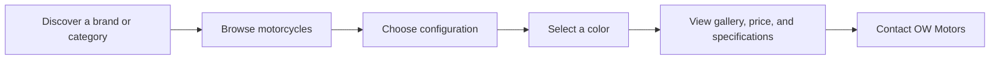
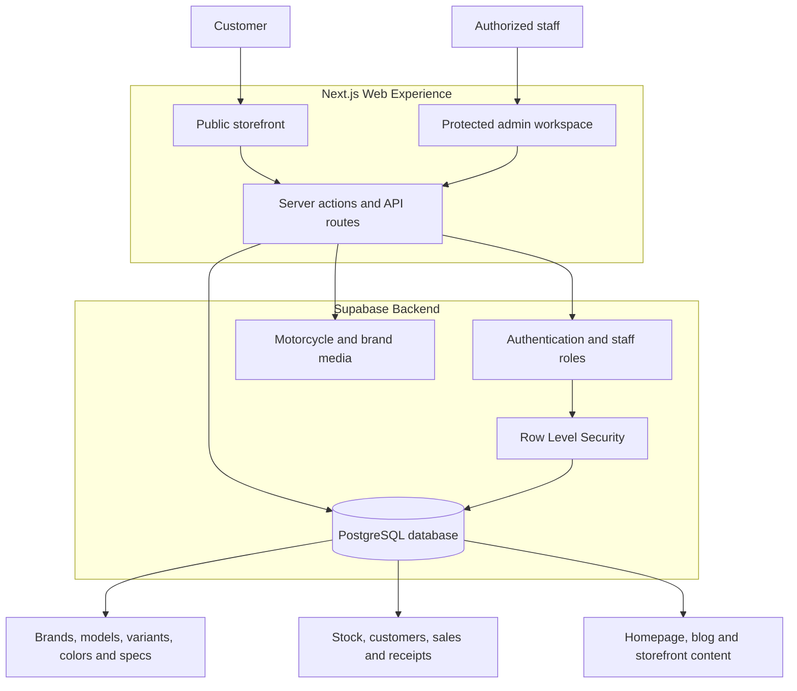

# OW Motors

OW Motors is a modern multi-brand motorcycle storefront and operations platform. Customers can explore motorcycles by brand and category, compare available configurations, browse color-specific galleries, review detailed technical specifications, and contact the showroom from any device.

The same platform includes a protected administration workspace for managing inventory, pricing, stock, customers, sales, receipts, media, homepage content, and staff access.

## Highlights

- Multi-brand motorcycle catalog with dedicated product pages
- Configuration-aware pricing for engine capacity and ABS variants
- Color-specific image galleries and availability
- Categorized technical specifications with a responsive mobile switcher
- Search-friendly metadata, sitemap, and structured public routes
- Responsive customer experience optimized for desktop and mobile
- Secure administrative workspace for day-to-day showroom operations
- Supabase-backed catalog, inventory, sales, content, and access control

## Customer experience



## Platform architecture



## Technology

- Next.js 16 and React 19
- TypeScript
- Tailwind CSS
- Supabase Authentication, PostgreSQL, Storage, and Row Level Security
- Zod validation
- Vercel-ready deployment

## Local development

Requirements:

- Node.js 20 or newer
- npm
- A configured Supabase project

Create `.env.local` in the project root:

```env
NEXT_PUBLIC_SUPABASE_URL=your_supabase_project_url
NEXT_PUBLIC_SUPABASE_PUBLISHABLE_KEY=your_publishable_key
SUPABASE_SERVICE_ROLE_KEY=your_server_only_service_role_key
SUPABASE_ACCESS_TOKEN=your_management_access_token
```

Install dependencies and start the development server:

```bash
npm install
npm run dev
```

Open [http://localhost:3000](http://localhost:3000).

## Quality checks

```bash
npm run lint
npm run build
```

## Data and media

Database changes are recorded in the `database` directory. Motorcycle photography is organized under `public/images/bikes` by brand, model, and color so shared visual variants can reuse the same gallery without duplicating product records.

Keep service-role keys and management tokens server-side. Environment files are ignored by Git and must never be committed.

## Ownership

Developed for OW Motors and its motorcycle customers in Pakistan.
